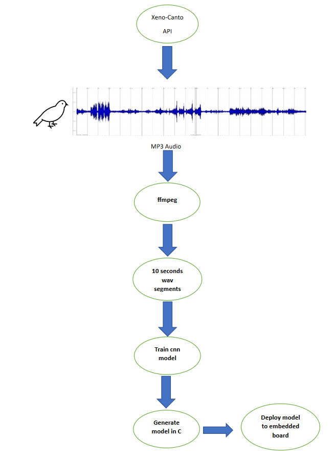

# Rendu Projet microIA

# Description du projet

Notre projet vise à identifier les chants d'oiseaux à partir de fichiers de test en utilisant une carte Nucleo-64 STM32L476 qui possède une faible quantité de RAM et de stockage (1 MB Flash, 128 KB SRAM) pour jouer les enregistrements, et à afficher les résultats dans la console. Nous avons construit notre base de données en récupérant des enregistrement grâce à l’API du site Xeno-canto, présentée pendant le cours, pour atteindre cet objectif.

# Description du flux du travail

Nous avons choisi d’avoir quatre classes dans notre base de données pour quatre espèces (Bruant jaune, Bruant zizi, Coucou gris et Gobemouche gris)

Nous avons récupéré tous les enregistrements de chants de qualité A et B pour les toutes les espèces et les chants de qualité C pour le Gobemouche gris car il n’a pas autant d’enregistrements de bonne qualité que les autres espèces.

Pour cela, Nous avons utilisé la librairie python [xeno-canto](https://pypi.org/project/xeno-canto/) qui est un wrapper d’api désigner afin d’aider les utilisateurs de récupérer les données souhaitées de xeno-canto.org.

Cette api nous a permis de récupérer des enregistrements de tailles différentes en format mp3. Nous avons donc utilisé ffmpeg pour découper ses derniers en segments de 10 secondes et les convertir en wav afin qu’on puisse extraire les données avec la librairie python wave.

Une fois que nos données sont prêts, on fait en sort que toutes les classes ont le même nombre d’enregistrement et on met aléatoirement les noms de 10% des enregistrements de chaque classe dans le fichier testing_list.txt et 10% dans validatio_list.txt. on aura donc un modèle d’apprentissage de 90% train 10% test 10% validation.

On charge après les données des enregistrements dans des tableaux train et test. est on entraine notre model cnn inspiré du modèle M5 et modifié pour qu’il entre dans la carte.

On génère après un code c pour le modèle avec des points fixes représentés sur 16 bits, On le compile et évalue une petite base de données afin de vérifiés si les résultats obtenus avec le modèle généré en c sont les même.

En fin, on déploie notre modèle sur la carte en lançant le code .ino et on teste notre ia embarquée en jouant des audios et en observant les résultats sur le “Moniteur série” d’arduino.

## Schéma illustratif du workflow

# Modèle CNN

Afin de pouvoir déployer notre modèle sur la carte, il était crucial de choisir un modèle de réseau de neurones convolutifs (CNN) qui n'utilise pas trop de ressources, notamment en RAM et en ROM. En effet, les modèles de CNN peuvent être très lourds et complexes, ce qui les rend difficiles à intégrer sur des systèmes embarqués ayant des contraintes de ressources. Nous avons donc pris soin de sélectionner un modèle adapté à ces contraintes afin de pouvoir obtenir des performances raisonnables tout en restant dans les limites de la carte.

Nous avons pris le modèle M5 vu en lab5, et nous avons changé les paramètres de nos données pour que l’input soit de dimension (10000,2). Donc nos données ont été redimensionnées à 10khz et 2 secondes.

Pour les couches de convolution, nous avons diminué les tailles des kernels et les nombres de filtres, et nous avons augmenté le nombre de strides pour la premiere couche de convolution

| conv layer | filters | kernel size | strides |
| ---------- | ------- | ----------- | ------- |
| first      | 8       | 30          | 10      |
| second     | 8       | 3           | default |
| third      | 8       | 3           | default |
| fourth     | 32      | 3           | default |

# Résultats obtenus

Dans un premier temps, Nous avons utilisé seulement les premiers 10 secondes de chaque enregistrement pour l’apprentissage et le test. Cette stratégie bous faisait perdre beaucoup d’informations et nous donnais une accuracy de 44%.

Cependant, après avoir utilisé le logiciel ffmpeg pour découper chaque audio en segments de 10 secondes et en utiliser la totalité, nous avons observé une amélioration significative de l'accuracy, qui est passée à 60%. Cette modification a permis d'inclure une quantité de données plus importante dans l'apprentissage du modèle, ce qui a contribué à améliorer ses performances.

En faisant un premier essaie avec toutes les classe, Nous avons remarqué que le model confondait le plus le bruant jaune avec le bruant zizi.

En écoutant quelques enregistrements, on peut remarquer qu’ils ont un chant similaire

Nous avant donc fait un autre essaie sans la classe du bruant jaune et l’accuracy est monté à 70%.

En effet, un des difficultés de faire apprendre une ia à reconnaitre les chants des oiseaux est la similarité de chants de plusieurs espèces.

Une autre difficulté est le fait que les audios sont souvent “polluée” par du bruit de font ou de chants d’autres espèces. Il y a aussi le fait que les oiseaux ont souvent plusieurs chants différents ( le “si yut-tee yut-tee” joyeux, le “te tuuiii" gazouillant, le “yun-yun-yun” alarmant, etc).

Le dernier problème que nous avons rencontré est le déséquilibre du nombre d’enregistrements entre les espèces. Cela est du au fait que certaines sont plus populaires que d’autres, et certaines sont plus rare que d’autre. Pour donner un exemple, nous avons décidé de ne pas inclure le Faucon crécerelle dans notre base de données car nous avons trouvé seulement une soixantaine d’enregistrements de chants pour cette espèce.

Nous sommes conscients que ces résultats ne sont pas encore à la hauteur de nos attentes. Toutefois, compte tenu du nombre limité de filtres que nous avons utilisés dans les couches de convolution et la baisse de la frequence et des secondes dans l’entrée pour pouvoir déployer le modèle sur la carte, cette performance reste tout à fait satisfaisante.

## Empreinte mémoire

Notre modèle utilise 46088 octets, soit 4% de l’espace de stokage de la carte .

## Latence

L’entrainement du modèle ne prends pas plus qu’environ trente secondes puisqu’on utilise un nombre réduit de paramètres d’entrés, de filtres et de kernels .

Dés qu’on joue une partie “reconnaissable” d’une audio de chants, on vois directement le label de la classe reconnue apparaitre sur la console du moniteur série, la réponse de la carte de la carte est donc quasiment immédiate.

## Consommation énergétique

# Conclusion

Pour conclure, notre projet a été une réussite et nous a permis d'acquérir de nouvelles compétences en traitement de données. Toutefois, pour améliorer encore davantage la précision de notre modèle d'identification des chants d'oiseaux, il serait intéressant de mettre en place un mécanisme de seuil de détection de niveau sonore. Ce dernier permettrait de détecter les parties du signal audio inutiles, telles que les silences entre les enregistrements ou les bruits de fond, et de les supprimer automatiquement. En éliminant ces parties superflues du signal, nous pourrions optimiser notre modèle et ainsi améliorer l'identification des chants d'oiseaux.
